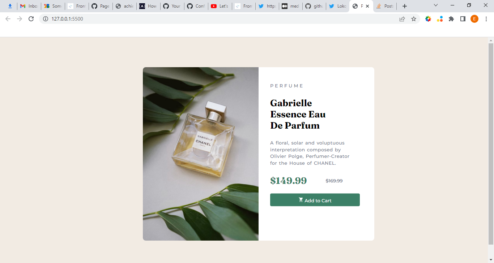

# Frontend Mentor - Product preview card component solution

This is a solution to the [Product preview card component challenge on Frontend Mentor](https://www.frontendmentor.io/challenges/product-preview-card-component-GO7UmttRfa). Frontend Mentor challenges help you improve your coding skills by building realistic projects. 

## Table of contents

- [Overview](#overview)
  - [The challenge](#the-challenge)
  - [Screenshot](#screenshot)
  - [Links](#links)
- [My process](#my-process)
  - [Built with](#built-with)
  - [What I learned](#what-i-learned)
  - [Continued development](#continued-development)
  - [Useful resources](#useful-resources)
- [Author](#author)
- [Acknowledgments](#acknowledgments)

**Note: Delete this note and update the table of contents based on what sections you keep.**

## Overview

### The challenge

Users should be able to:

- View the optimal layout depending on their device's screen size
- See hover and focus states for interactive elements

### Screenshot




### Links

- Solution URL: [Add solution URL here](https://your-solution-url.com)
- Live Site URL: [Add live site URL here](https://your-live-site-url.com)

## My process

### Built with

- Semantic HTML5 markup
- CSS custom properties
- Flexbox
- [Styled Components](https://fonts.google.com/) - For fonts


### What I learned

I learnt a better way to use flexbox and it's properties. I also learnt about the div property better especially how to center it with ease.
Also i learnt how to use media queries better. 


```css
.proud-of-this-css {
  display: flex;
}
```


### Continued development
-Flex box
-Media Queries
-Positioning i.e absolute, relative,fixed and static


### Useful resources

- [Example resource 1](https://fonts.google.com/) - This helped me for styling the text in the project. I really love it and wil keep using it for future projects
- [Example resource 2](https://ionic.io/ionicons) - This is an amazing article which helped me with the order icon. I'd recommend it to anyone finding a hard time looking for icons 


## Author

- Website - [Add your name here](https://www.your-site.com)
- Frontend Mentor - [@Achiever011](https://www.frontendmentor.io/profile/Achiever011)
- Twitter - [@EjehAchiever](https://www.twitter.com/EjehAchiever)


## Acknowledgments
Special thanks to God for guidance and my tutor (Twitter- [@josh_script]) 


